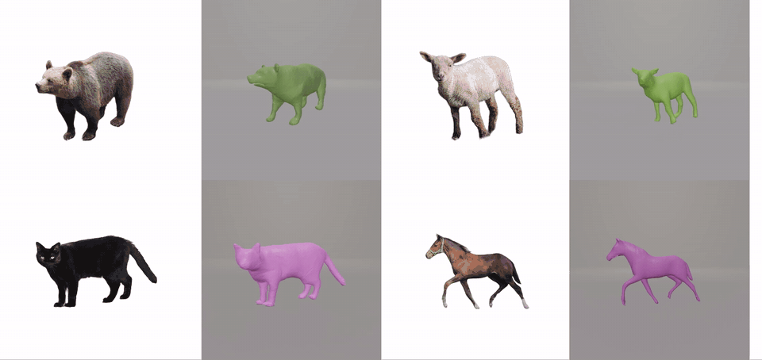

<div align="center">

# HiAnimal: Towards High-fidelity and Animatable Mesh Reconstruction from Single-view In-the-Wild Animal Images

**Huimin Zhang, Zhongjin Luo, Kenkun Liu, Xihe Yang, Haolin Liu, Weikai Chen, Xiaoguang Han**



</div>

## About

**HiAnimal** reconstructs high-fidelity and animatable 3D quadruped meshes from a single in-the-wild image. It predicts a pixel-aligned Occupancy-UV field from an estimated normal map and aligns a parametric SMAL template with the reconstructed surface, producing image-aligned geometry with fine details, consistent topology, and transferable rigging for animation.

## Installation

The following environment produced the smoothest reconstruction results in our tests.

```bash
conda create -n hianimal_train python=3.8.10 -y
conda activate hianimal_train

conda install -c conda-forge pyembree=0.1.6 -y

python -m pip install torch==1.8.1+cu111 torchvision==0.9.1+cu111 \
  --extra-index-url https://download.pytorch.org/whl/cu111

python -m pip install \
  numpy==1.21.0 scipy==1.10.1 scikit-image==0.16.2 \
  opencv-python==4.2.0.32 Pillow==9.0.0 tqdm==4.43.0 \
  trimesh==3.5.23 networkx==2.4 matplotlib==3.1.3 \
  pyparsing==2.4.6 python-dateutil==2.8.1 six==1.14.0
```

## Training and testing

The [`hianimal_train`](./hianimal_train) directory contains the compact
Occupancy-UV training and reconstruction pipeline, a pretrained checkpoint,
10 complete training examples, and cat/sheep test inputs. All bundled paths
are self-contained; the original large training dataset is not required for
the included example run.

```bash
conda activate hianimal_train
cd hianimal_train

# Train on the 10 bundled examples.
./train.sh

# Reconstruct the bundled cat normal map with the included checkpoint.
./predict.sh
```

See [`hianimal_train/README.md`](./hianimal_train/README.md) for the data
layout, outputs, checkpoint behavior, and full commands.
